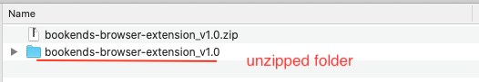
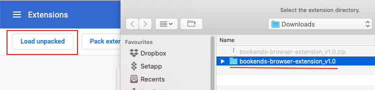

# Bookend Browser Extension

## Description

Chrome extension to open the currently viewed webpage in the Bookends browser.

## Installation

- To activate, download the most recent *.zip release archive  from the Releases on the right-hand side of the repository page, and unzip it.

 (The releases page).

 (After downloading and unzipping).

- Then in the extensions menu for any Chromium based browser, with Developer mode turned on, select 'Load unpacked' and select the unzipped folder for the extension to activate it.

 (Turn on Developer mode by clicking the button in the top-right corner, on the chrome://extensions/ URL).

 (Select the unzipped folder when the file menu opens up).

 (The installed extension).

